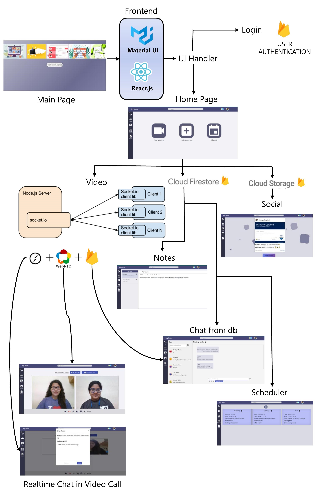

## BUILD A MICROSOFT TEAMS CLONE  ( [Microsoft Engage 2021 Challenge](https://microsoft.acehacker.com/engage2021/?mc_cid=a82d11f2ad&mc_eid=89874c26af) )
( Multiple features including ~ :star2: Multiple Participants Video Calling with Realtime Chat + :star2: Adopt Feature implemented using Database)

:link: [https://my-teams-172e9.web.app/](https://my-teams-172e9.web.app/)

## <ins>Functionalities</ins> 

### A) Multi-user Video Calling and Realtime Chat:
  
 :one: ***Video calling for multiple participants***\
 :two: ***Realtime Chat among multiple partcipants using Socket.IO***\
 :three: ***Send meeting invite via Email to participants from within the app***\
 :four: ***Screen Sharing***\
 :five: ***Audio mute and unmute***\
 :six: ***Video on and off***\
 :seven: ***Screen Recording***\
 :eight: ***Whiteboard***\
 :nine: ***Start a meeting OR Join a chat with URL***
 
 ### :sparkles: <ins>Adopt Feature:</ins> 
 * Users can create a room before hand and start a conversation before meeting
 * Realtime chat within meeting is stored in the database and available in the room even after meeting is ended.
 * If a room is not created beforehand a new conversation room is created as soon as a new meeting is started and all the chat is stored in it.
 * A video meeting can be started from within the chat whenever needed.
 
### B) Social:
 
 :one: ***Members/Users can add posts to share with others such as image to update them about any event such as an upcoming workshop,a certificate received etc.***\
 :two: ***Easy upload funtion to add images in 2 clicks***\
 :three: ***Option to add a caption to the image while uploading***\
 :four: ***Ability for other users to view posts by others in social page and comment on the posts***\
 :five: ***All functions take place realtime and database is updated immediately when a new post/comment is added. Then it is displayed on the social page.***

### C) Chat Rooms:

#### :star:Special feature to run sentimental analysis on the typed text. When we type in a message and click on Run Analysis a result box is displayed that shows:
:white_check_mark: Sentimental Score of the message typed\
:white_check_mark: Whether the message is positive/negative/neutral

 :one: ***Create new Rooms with just a click***\
 :two: ***Multiple participants allowed to converse in group chat room***\
 :three:***Start Video call with participants in the chat with ease***\
 :four: ***Searchbar to search through the chats***\
 :five: ***Emoji Board attached to chat input***
 
 ### D) Notes: (CRUD Functionality enabled)
 
:one: ***Create new notes with a title and content***\
:two: ***Full fledged text editor implemented using React Quill***\
:three:***Cloud storage to store all your notes permanently on Firebase and Firestore***\
:four: ***Delete and edit contents of notes body and also it's title***

### E) Scheduler:
 
:one: ***Create new events and add title, description, date and duration***\
:two: ***Delete events as and when required***

## <ins>Application Architecture</ins>
 

## <ins>Technologies</ins>
- React.js
- Node.js
- JavaScript
- Firestore
- WebRTC
- Socket.io
 
## <ins>Credits</ins>
Video Meeting component was open-sourced and re-purposed from [Video Meeting](https://github.com/0x5eba/Video-Meeting).

This project was bootstrapped with [Create React App](https://github.com/facebook/create-react-app).

Took suggestions and discussed project ideas with [Dwitrisha](https://github.com/Dwitrisha).

## Available Scripts

In the project directory, you can run:

### `npm start`

Runs the app in the development mode.\
Open [https://my-teams-172e9.web.app/](https://my-teams-172e9.web.app/) to view it in the browser.

The page will reload if you make edits.\
You will also see any lint errors in the console.

### `npm test`

Launches the test runner in the interactive watch mode.\
See the section about [running tests](https://facebook.github.io/create-react-app/docs/running-tests) for more information.

### `npm run build`

Builds the app for production to the `build` folder.\
It correctly bundles React in production mode and optimizes the build for the best performance.

The build is minified and the filenames include the hashes.\
Your app is ready to be deployed!

See the section about [deployment](https://facebook.github.io/create-react-app/docs/deployment) for more information.

### `npm run eject`

**Note: this is a one-way operation. Once you `eject`, you can’t go back!**

If you aren’t satisfied with the build tool and configuration choices, you can `eject` at any time. This command will remove the single build dependency from your project.

Instead, it will copy all the configuration files and the transitive dependencies (webpack, Babel, ESLint, etc) right into your project so you have full control over them. All of the commands except `eject` will still work, but they will point to the copied scripts so you can tweak them. At this point you’re on your own.

You don’t have to ever use `eject`. The curated feature set is suitable for small and middle deployments, and you shouldn’t feel obligated to use this feature. However we understand that this tool wouldn’t be useful if you couldn’t customize it when you are ready for it.

## Learn More

You can learn more in the [Create React App documentation](https://facebook.github.io/create-react-app/docs/getting-started).

To learn React, check out the [React documentation](https://reactjs.org/).

### Code Splitting

This section has moved here: [https://facebook.github.io/create-react-app/docs/code-splitting](https://facebook.github.io/create-react-app/docs/code-splitting)

### Analyzing the Bundle Size

This section has moved here: [https://facebook.github.io/create-react-app/docs/analyzing-the-bundle-size](https://facebook.github.io/create-react-app/docs/analyzing-the-bundle-size)

### Making a Progressive Web App

This section has moved here: [https://facebook.github.io/create-react-app/docs/making-a-progressive-web-app](https://facebook.github.io/create-react-app/docs/making-a-progressive-web-app)

### Advanced Configuration

This section has moved here: [https://facebook.github.io/create-react-app/docs/advanced-configuration](https://facebook.github.io/create-react-app/docs/advanced-configuration)

### Deployment

This section has moved here: [https://facebook.github.io/create-react-app/docs/deployment](https://facebook.github.io/create-react-app/docs/deployment)

### `npm run build` fails to minify

This section has moved here: [https://facebook.github.io/create-react-app/docs/troubleshooting#npm-run-build-fails-to-minify](https://facebook.github.io/create-react-app/docs/troubleshooting#npm-run-build-fails-to-minify)

